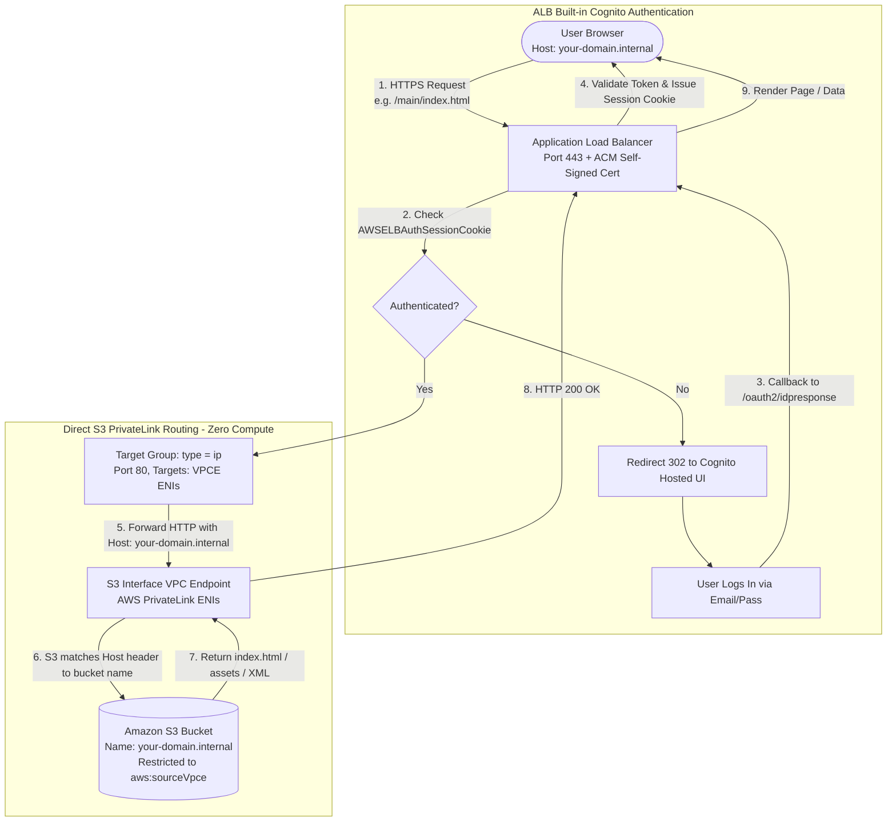

# Cognito-Guarded Multi-App S3 Hosting via ALB & VPC Endpoint (PrivateLink)

A serverless, zero-compute architecture to host multiple independent static React / HTML applications and artifacts (e.g., generated via [Lavish](https://github.com/kunchenguid/lavish)) on Amazon S3 behind an AWS Application Load Balancer (ALB), guarded by a single AWS Cognito authentication gate with **zero authentication code inside the static applications**.

---

## 🎯 Project Intention & Problem Statement

### The Problem
When building and publishing static artifacts (e.g. data dashboards, security reports, UI prototypes generated by agentic workflows like Lavish), teams often deploy multiple independent apps under subpaths such as:
- `/web1/index.html`
- `/web2/index.html`
- `/web3/index.html`

Guarding these apps behind corporate authentication typically presents painful challenges:
1. **Intrusive Auth Code**: Hardcoding login widgets, OAuth SDKs, or Cognito tokens into every single generated `index.html` breaks the clean, standalone nature of static artifacts.
2. **Session Fragmentation**: Logging into `/web1` shouldn't force the user to re-authenticate when navigating to `/web2`.
3. **Compute Overhead & Cold Starts**: Standard solutions rely on EC2 reverse proxies (NGINX) or Lambda functions to fetch S3 objects, introducing operational maintenance, costs, and cold start latency.
4. **Discoverability**: Users do not know what apps exist unless someone gives them the exact subpath URL.

### The Solution
This project implements a fully serverless, direct-to-S3 architectural pattern:
- **ALB Layer-7 Authentication Gate**: The Application Load Balancer intercepts all HTTPS traffic, redirects unauthenticated requests to the AWS Cognito Hosted UI, and issues a domain-scoped `AWSELBAuthSessionCookie`. Authenticating once grants instant access across all subpaths.
- **Direct S3 via AWS PrivateLink (No Compute / No Lambda Proxy)**: The ALB routes traffic directly to the private IP addresses of an **Amazon S3 Interface VPC Endpoint**. S3 uses virtual-hosted-style addressing (the HTTP `Host` header) to directly identify and serve the S3 bucket.
- **Domain Name = S3 Bucket Name**: By matching the ALB domain name, the self-signed TLS certificate Common Name (CN), and the S3 bucket name, requests resolve directly to the target bucket with zero translation proxies.
- **Dynamic Central Website Catalog (`/main/index.html`)**: Built with [Lavish](https://github.com/kunchenguid/lavish) guidelines (Tailwind CSS v4 + DaisyUI v5), it natively queries S3 bucket prefixes (`/?list-type=2&delimiter=/`) via the S3 REST API to automatically discover and display newly deployed apps without any code changes or redeployments.

---

## 🏗️ Architecture Diagram



---

## 🔍 How It Works (Deep Dive)

### 1. Single Sign-On across All Subpaths
1. A user visits `https://your-domain.internal/web1/index.html`.
2. The ALB checks for the `AWSELBAuthSessionCookie`. If missing, the ALB returns HTTP 302 redirecting the user to the **Cognito Hosted UI**.
3. After the user logs in, Cognito redirects back to `https://your-domain.internal/oauth2/idpresponse?code=...`.
4. The ALB exchanges the authorization code for Cognito user tokens, stores them internally, sets an encrypted `AWSELBAuthSessionCookie` in the browser, and redirects to `/web1/index.html`.
5. When the user navigates to `/web2/index.html`, the browser transmits the same session cookie. The ALB validates it and serves the page immediately with **zero re-login prompts**.

### 2. S3 Interface VPC Endpoint Routing
- The S3 Interface VPC Endpoint creates Elastic Network Interfaces (ENIs) in your VPC private subnets.
- The ALB target group targets the private IP addresses of these ENIs on port 80.
- When an HTTP request reaches the S3 VPC endpoint, S3 inspects the HTTP `Host` header.
- Because `Host: your-domain.internal` matches the S3 bucket name `your-domain.internal`, the S3 REST API identifies the target bucket and retrieves the object matching the URL path (e.g. `web1/index.html`).

### 3. Dynamic Prefix Discovery (`/main/index.html`)
- The central catalog at `/main/index.html` runs client-side JavaScript that executes:
  ```javascript
  fetch('/?list-type=2&delimiter=/')
  ```
- An ALB listener rule matches `Path is "/"` AND `Query string contains list-type=2`, forwarding the request to the S3 VPC Endpoint.
- S3 executes its native `ListObjectsV2` REST API and returns an XML document containing `<CommonPrefixes><Prefix>folder/</Prefix></CommonPrefixes>`.
- The catalog parses this XML, ignores `main/`, and dynamically builds interactive application cards for every subfolder discovered (`web1/`, `web2/`, `web3/`, etc.).
- When a new application is uploaded to S3 (e.g. `s3://your-domain.internal/web4/index.html`), clicking **Refresh** on `/main/index.html` instantly detects and displays it.

---

## 🔒 Security Analysis of Dynamic S3 Prefix Listing

| Security Aspect | Implementation | Details |
| :--- | :--- | :--- |
| **Authentication Gate** | ALB Cognito Action | The `/?list-type=2` discovery endpoint is guarded behind Cognito authentication. Unauthenticated requests are rejected and redirected to the login UI. |
| **Network Isolation** | AWS PrivateLink | S3 Block Public Access is fully enabled. Bucket policies enforce `aws:sourceVpce = <vpce-id>`. Direct Internet access to the bucket is impossible. |
| **Bucket Policy Scope** | Minimal Actions | The bucket policy grants only `s3:GetObject` on `${bucket}/*` and `s3:ListBucket` on `${bucket}`. No write, delete, or permission modifications are permitted. |
| **Information Disclosure** | Folder/Key Visibility | `s3:ListBucket` allows any authenticated user to view object keys and prefix names in that bucket. **Do not store sensitive secrets or confidential files in this bucket.** |

---

## 📁 Repository Structure

```
├── artifacts/                     # Static web apps & Lavish artifacts
│   ├── main/index.html            # Dynamic central catalog portal
│   ├── web1/index.html            # Project Phoenix (Analytics Dashboard)
│   ├── web2/index.html            # Project Orion (Security & Compliance Audit)
│   └── web3/index.html            # Project Nebula (Telemetry Monitor)
├── terraform/                     # Complete Infrastructure-as-Code
│   ├── alb.tf                     # ALB, IP Target Group, Listeners & Rules
│   ├── certificate.tf             # ACM Self-Signed TLS Certificate
│   ├── cognito.tf                 # Cognito User Pool, Client & Test User
│   ├── generate_cert.py           # Helper to generate self-signed PEM
│   ├── outputs.tf                 # Terraform outputs & test instructions
│   ├── s3.tf                      # S3 bucket, PrivateLink policy & uploads
│   ├── variables.tf               # Input variables
│   ├── versions.tf                # Required providers (aws, tls, random)
│   ├── vpc.tf                     # VPC, Subnets, Security Groups & IGW
│   └── vpce.tf                    # S3 Interface VPC Endpoint & ENI lookup
├── .gitignore                     # Ignores tfstate, keys, and temp files
└── README.md                      # Complete architecture & usage documentation
```

---

## 🚀 Quickstart & Deployment

### Prerequisites
- [Terraform](https://www.terraform.io/) >= 1.5.0
- [AWS CLI](https://aws.amazon.com/cli/) configured with appropriate IAM credentials
- Python 3 with `cryptography` library (`pip install cryptography`)

### Step 1: Clone & Configure
```bash
git clone <repo-url>
cd cognito-alb-index/terraform
```

### Step 2: Initialize & Deploy
```bash
terraform init
terraform plan
terraform apply -auto-approve
```

### Step 3: Local DNS Resolution
Because the ALB uses a custom internal domain name matching the self-signed certificate and S3 bucket name (e.g. `poc-apps-ci36u7.internal`), add an entry to your local `hosts` file:

**On Windows (Run PowerShell as Administrator):**
```powershell
Add-Content -Path C:\Windows\System32\drivers\etc\hosts -Value "`n<ALB_PUBLIC_IP> <DOMAIN_NAME>"
```

**On Linux/macOS:**
```bash
sudo echo "<ALB_PUBLIC_IP> <DOMAIN_NAME>" >> /etc/hosts
```

### Step 4: Access in Browser
1. Open your browser and navigate to:
   ```
   https://<DOMAIN_NAME>/main/index.html
   ```
2. Accept the self-signed certificate prompt (Click **Advanced** -> **Proceed to <DOMAIN_NAME> (unsafe)** or type `thisisunsafe`).
3. Log in with the pre-provisioned test credentials:
   - **Email**: `tester@example.com`
   - **Password**: `P@ssw0rd1234!`
4. Explore the dynamic catalog and switch between `/web1/index.html`, `/web2/index.html`, and `/web3/index.html` seamlessly without repeated logins.

---

## ➕ Adding New Applications Dynamically

To deploy a new application (e.g. `/web4`):
1. Upload your static assets directly to S3:
   ```bash
   aws s3 cp my-app/index.html s3://<DOMAIN_NAME>/web4/index.html
   ```
2. Open `https://<DOMAIN_NAME>/main/index.html` and click **Refresh**.
3. S3's `ListObjectsV2` API dynamically detects the new `web4/` prefix and renders a card for it automatically!

---

## 🧹 Teardown

To destroy all deployed AWS resources and avoid ongoing charges:
```bash
cd terraform
terraform destroy -auto-approve
```
